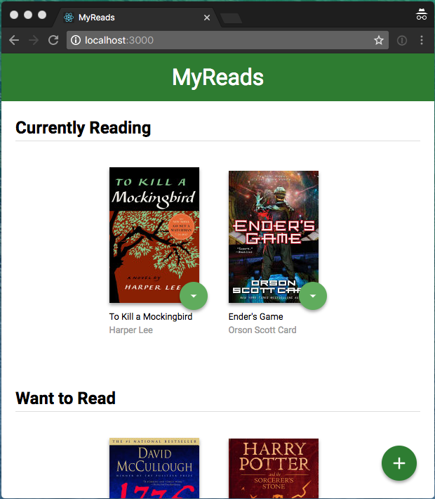

# MyReads Project
## Overview
This is a final assessment project for Udacity's React Fundamentals course. The application is a simple "TODO" application where the user can move books in different states (Read, WantToRead or Currently Reading)
<br>
<br>
Starter code included a singlePage mockup of the application and we had to implement code and logic. To prove our understanding of basic React States.
<br><br>Some of the tasks included
* create a mockup of components
* read books from backend api
* manage state
* add/delete/toogle books
* navigation
<br>etc..

## The app (Printscreen)




## Run project


* install all project dependencies with `npm install`
* start the development server with `npm start`


## Dependencies: Backend Server

A remote backend Server is located at https://reactnd-books-api.udacity.com hosted by Udacity. You don´t need to do anything when you run the project with 'npm start', a temp userToken is auto-generated to get access to the API.


[`BooksAPI.js`](src/BooksAPI.js) contains all functions needed for communicate with backend.

* [`getAll`](#getall)
* [`update`](#update)
* [`search`](#search)

### `getAll`

Method Signature:

```js
getAll()
```

* Returns a Promise which resolves to a JSON object containing a collection of book objects.
* This collection represents the books currently in the bookshelves in your app.

### `update`

Method Signature:

```js
update(book, shelf)
```

* book: `<Object>` containing at minimum an `id` attribute
* shelf: `<String>` contains one of ["wantToRead", "currentlyReading", "read"]
* Returns a Promise which resolves to a JSON object containing the response data of the POST request

### `search`

Method Signature:

```js
search(query)
```

* query: `<String>`
* Returns a Promise which resolves to a JSON object containing a collection of a maximum of 20 book objects.
* These books do not know which shelf they are on. They are raw results only. You'll need to make sure that books have the correct state while on the search page.

## Important
The backend API uses a fixed set of cached search results and is limited to a particular set of search terms, which can be found in [SEARCH_TERMS.md](SEARCH_TERMS.md). That list of terms are the _only_ terms that will work with the backend, so don't be surprised if your searches for Basket Weaving or Bubble Wrap don't come back with any results.
